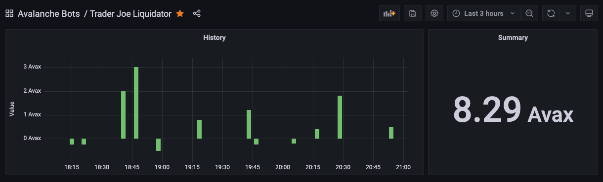

# Trader Joe Liquidator

1. Monitor underwater accounts via TraderJoe lending subgraph. I used codegen and the subgraph schema to generate types for the query return.
2. Determine the best target for liquidation and which assets to repay and seize using a recursive function.
3. Trigger the liquidate method from my contract.
4. Keeps profits in wAvax so I can withdraw them from time to time to pay for the fees.
5. Monitor the bot activity using Grafana.

Main files :
contract/JoeLiquidatoor.sol for the smart contract part
scripts/bot.ts for the bot script

Additional files :
liquidation-from-script and liquidation-from-contract are two playground scripts that I used for developpment
database.service.ts connects to my MongoDB database
ABI folder comes from TJ github and has every ABI and adresses or the Banker Joe contracts

## Installation

```
npm install
npx run codegen
npx hardhat compile
```
The first compilation is done to generate typechain types.

## Smart Contract Flow

I send to my smart contract the liquidated, collateral and flashloan tokens, and the amount that I want to liquidate.

I use wAvax as much as I can for the flashloan as it is easier to swap it with the others tokens. When I can't, I use USDC.e ou USDT.e, from the two biggest pools on TJ for lower slippage.

I determine how much token I need to borrow, then engage the flashloan. Flashloan token is swapped to repay borrow. I then swap the collateral seized into wAvax first, then swap the necessary amount only to repay the flashloan. Profits are kept in wAvax and I have infinite allowance on them to get them back by batch.

## Proofs

Here is the two liquidations I made on mainnet :
1. https://snowtrace.io/tx/0x4c5cf4a222f54a70fcf6b3ef003c9305e2641d59ef7524ca22bad8c580b7b800
2. https://snowtrace.io/tx/0x3c37a7d1c16550ef43d4559160b3867588864e9fc3f98640f51dda6a28f3e0ba

## Monitoring

I love Grafana so I have set up a basic Grafana display to monitor all the flashloan attempts. I use my InfluxDB instance to store the data. These are no real profits sadly, just mock data.


## Credits

I use the solidity boilerplate from https://github.com/ava-labs/avalanche-smart-contract-quickstart, to which I also added typechain.

https://github.com/Max-3-7/liquidation-bot-monitoring has been helpful to get started.
